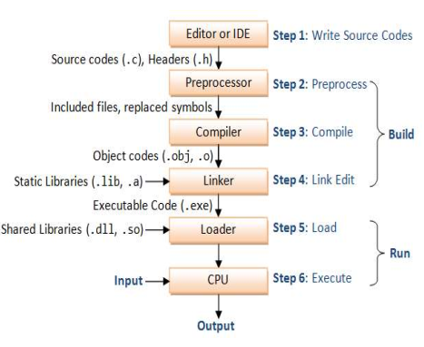

A. COMPILER        
***How to make a program for computer?***   
***->Step 1***: Write the source codes (.c) and header files (.h).   
***->Step 2***: Pre-process the source codes according to
the preprocessor directives. The preprocessor directives
begin with a hash sign (#), such as #include and #define.
They indicate that certain manipulations (such as including
another file or replacement of symbols) are to be performed
BEFORE compilation.   
***->Step 3***: Compile the pre-processed source codes into object
codes (.obj, .o).   
***->Step 4***: Link the compiled object codes with other object
codes and the library object codes (.lib, .a)to produce the
executable code (.exe).  
***->Step 5***: Load the executable code into computer memory.  
***->Step 6***: Run the executable code.   

B. MACRO   
So MACRO is a word used to refer to the information processed in the preprocessor. Divided into 3 main groups:    
    - Header or Library files: #include  
    - Replace macro_name by macro_value before compile to the .bin file: #define, #undef   
    - Conditional compilation directives: #if, #elif, #else, #ifdef, #ifndef   

***Example 1:***   
#if condition_1   
TODO 1;  
#elif condition_1   
TODO 2;   
#else   
TODO 3;   
#endif  
***=>explaination***: If "condition_1" is true, then TODO 1 is built. If condition_2 is true, then TODO 2 is selected to build. If conditions_1 and 2 are both false, then TODO 3 is selected for build.

***Example 2:***    
#ifdef macro  
TODO 1;   
#else  
TODO 2;   
#endif   
***=>explaination***: If the macro is already defined by #define macro, then TODO 1 is selected to build. If not defined, TODO 2 is selected to build.

***Example 3:***   
#ifndef macro  
TODO 1;   
#else  
TODO 2;   
#endif   
***=>explaination***: In the opposite way compare to #ifdef. If the macro is not defined, then TODO 1 is selected to build. If already defined, TODO 2 is selected to build.

***Code example:***   

        #include <stdio.h>       typedef enum
    {
        GPIOA,
        GPIOB,
        GPIOC
    } Ports;
    
    typedef enum{
        PIN1,
        PIN2,
        PIN3,
        PIN4,
        PIN5,
        PIN6,
        PIN7,
    } Pins;

    typedef enum
    {
        HIGH,
        LOW
    } Status;

    #define STM32 0
    #define ATMEGA 
    #define PIC 2
    
    #define MCU STM32
    
    #if MCU == STM32
    void daoTrangThaiDen(Ports port, Pins pin, Status status)
    {
        if (status == HIGH)
        {
            HAL_GPIO_WritePin(port, pin, LOW);
        }
        else
        {
            HAL_GPIO_WritePin(port, pin, HIGH);
        }  
    }
        
    #elif MCU == ATMEGA 
    void daoTrangThaiDen(Pins pin, Status status)
    {
        if (status == HIGH)
        {
            digitalWrite(pin, LOW);
        }
        else
        {
            digitalWrite(pin, HIGH);
        }  
    }

    #endif
    void delay(int ms){}
    
    int main()
    {
        while(1)
        {
            daoTrangThaiDen(GPIOA,13,HIGH);
            delay(1000);
        }

    return 0;
    }

        
