# **LESSON 1: COMPILER AND MACRO**

## A. COMPILER        
***How to make a program for computer?***   
***->Step 1***: Write the source codes (.c) and header files (.h).   
***->Step 2***: Pre-process the source codes according to
the preprocessor directives. The preprocessor directives
begin with a hash sign (#), such as #include and #define.
They indicate that certain manipulations (such as including
another file or replacement of symbols) are to be performed
BEFORE compilation.   
***->Step 3***: Compile the pre-processed source codes into object
codes (.obj, .o).   
***->Step 4***: Link the compiled object codes with other object
codes and the library object codes (.lib, .a)to produce the
executable code (.exe).  
***->Step 5***: Load the executable code into computer memory.  
***->Step 6***: Run the executable code.   

## B. MACRO   
So MACRO is a word used to refer to the information processed in the preprocessor. Divided into 3 main groups:    
    - Header or Library files: #include  
    - Replace macro_name by macro_value before compile to the .bin file: #define, #undef   
    - Conditional compilation directives: #if, #elif, #else, #ifdef, #ifndef   

***Example 1:***   

    #if condition_1   
    TODO 1;  
    #elif condition_1   
    TODO 2;   
    #else   
    TODO 3;   
    #endif  
**=>explaination**: If "condition_1" is true, then TODO 1 is built. If condition_2 is true, then TODO 2 is selected to build. If conditions_1 and 2 are both false, then TODO 3 is selected for build.

***Example 2:***    

    #ifdef macro  
    TODO 1;   
    #else  
    TODO 2;   
    #endif   
**=>explaination**: If the macro is already defined by #define macro, then TODO 1 is selected to build. If not defined, TODO 2 is selected to build.

***Example 3:***   

    #ifndef macro  
    TODO 1;   
    #else  
    TODO 2;   
    #endif   
**=>explaination**: In the opposite way compare to #ifdef. If the macro is not defined, then TODO 1 is selected to build. If already defined, TODO 2 is selected to build.

***Code example:***   

    #include <stdio.h>      
    typedef enum
    {
        GPIOA,
        GPIOB,
        GPIOC
    } Ports;
    
    typedef enum{
        PIN1,
        PIN2,
        PIN3,
        PIN4,
        PIN5,
        PIN6,
        PIN7,
    } Pins;

    typedef enum
    {
        HIGH,
        LOW
    } Status;

    #define STM32 0
    #define ATMEGA 
    #define PIC 2
    
    #define MCU STM32
    
    #if MCU == STM32
    void daoTrangThaiDen(Ports port, Pins pin, Status status)
    {
        if (status == HIGH)
        {
            HAL_GPIO_WritePin(port, pin, LOW);
        }
        else
        {
            HAL_GPIO_WritePin(port, pin, HIGH);
        }  
    }

    #elif MCU == ATMEGA 
    void daoTrangThaiDen(Pins pin, Status status)
    {
        if (status == HIGH)
        {
            digitalWrite(pin, LOW);
        }
        else
        {
            digitalWrite(pin, HIGH);
        }  
    }

    #endif
    void delay(int ms){}
    
    int main()
    {
        while(1)
        {
            daoTrangThaiDen(GPIOA,13,HIGH);
            delay(1000);
        }

    return 0;
    }

# **LESSON 2: STDARG AND ASSERT**

## A. STDARG
***Concept***    
The stdarg.h header file in C allows functions to accept a variable number of arguments. It provides macros and a type (va_list) for accessing and manipulating these arguments. 

📝 ***Key Features of stdarg.h***  
**va_list**: A type that represents a list of arguments.  
**va_start(ap, last_named_arg)**: Initializes a va_list object to point to the first unnamed argument after last_named_arg.   
**va_arg(ap, type)**: Retrieves the next argument from the va_list and converts it to the specified type.   
**va_end(ap)**: Cleans up the va_list object.

***Example***  

    #include <stdio.h>  
    #include <stdarg.h>               
    /* print all args one at a time until a negative argument is seen;
    all args are assumed to be of int type */

    void printargs(int arg1, ...)  
    {  
        va_list ap;  
        int i;
        va_start(ap, arg1);   
        for (i = arg1; i >= 0; i = va_arg(ap, int))  
        printf("%d ", i);  
        va_end(ap);  
        putchar('\n');  
    }

    int main(void)  
    {  
        printargs(5, 2, 14, 84, 97, 15, -1, 48, -1);  
        printargs(84, 51, -1, 3);  
        printargs(-1);  
        printargs(1, -1);  
        return 0;  
    }

**Output**

    5 2 14 84 97 15  
    84 51

    1

## B. ASSERT
***Concept***  
- Asserts are used in programs if the developer wishes to assert or make assumptions.  
- It takes an expression for the parameter in the function. The parameter is evaluated.   
- If the value returned after evaluation of the expression is 0 or FALSE, it returns the expression along with the file name and line of execution as an error.  
- If the errors occur, the program calls the abort() function. The assert function does not do anything if the expression is evaluated TRUE.

***Syntax***  

        void assert( int expression);  
        
***Example***  

    #include <assert.h>
    #include <stdio.h>
    int main()
    {
        int a;
        char str[50];
            
        printf("Nhap mot gia tri nguyen: \n");
        scanf("%d", &a);
        assert(a >= 10);
        printf("Gia tri nguyen vua nhap la %d\n", a);
            
        printf("Nhap mot chuoi: ");
        scanf("%s", &str);
        assert(str != NULL);
        printf("Chuoi vua nhap la: %s\n", str);
            
        return(0);
    }

    
**Output 1**

**Output 2**

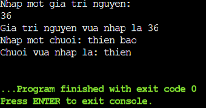

# **LESSON 3: POINTER**

## A. Pointer  
***Concept***  
In the C programming language, a pointer is a variable that contains the memory address of another variable. The use of the pointer helps us to perform operations on memory in a more flexible way. 

***How to declare:***  

    int *ptr;  // a pointer to int type
    char *ptr_char;  // a pointer to char type
    float *ptr_float;  // a pointer to float type

***Get the address of a variable and access the value:***

    int x = 10;
    int *ptr_x = &x;  // ptr_x now contains address of x
    int y = *ptr_x;  // y equals to the value of x

***The size of the pointer depends on the computer architecture and compiler:***

    #include <stdio.h>

    int main() 
    {
        int *ptr;
        printf("Size of pointer: %d bytes\n", sizeof(ptr));
        return 0;
    }

***Example***

    #include <stdio.h>
    void swap(int *a, int *b)
    {
        int tmp = *a;
        *a = *b;
        *b = tmp;
    }
    int main()
    {
        int a = 10, b = 20;
        swap(&a, &b);

        printf("value a is: %d\n", a);
        printf("value b is: %d\n", b);

        return 0;
    }

## B. Void Pointer
***Concept***  
Void pointers are often used to point to any address without knowing the data type of the value at that address.

***Syntax***

    void *ptr_void;

***Example***

    #include <stdio.h>
    #include <stdlib.h>

    int sum(int a, int b)
    {
        return a+b;
    }

    int main() 
    {
    
        char array[] = "Hello";
        int value = 5;
        double test = 15.7;
        char letter = 'A';
    
        void *ptr = &value;
        printf("value is: %d\n", *(int*)(ptr));

        ptr = &test;
        printf("value is: %f\n", *(double*)(ptr));

        ptr = &letter;
        printf("value is: %c\n", *(char*)(ptr));

        ptr = sum;
        printf("sum: %d\n", ((int (*)(int,int))ptr)(5,6));

        void *ptr1[] = {&value, &test, &letter , sum, array};

        printf("value: %d\n", *(int*)ptr1[0]);

        printf("value: %c\n", *((char*)ptr1[4]+1));

        return 0;
    }

## C. Function Pointer
***Concept***  
A pointer to function is a variable that holds the address of a function. That is, it points to the area of memory that contains the machine code of the function defined in the program.

***Syntax***

    <return_type> (*<name_of_pointer>)( <data_type_of_parameters> );

***Example***

    #include <stdio.h>

    void sum(int a, int b)
    {
        printf("Sum of %d and %d is: %d\n",a,b, a+b);
    }

    void subtract(int a, int b)
    {
        printf("Subtract of %d by %d is: %d \n",a,b, a-b);
    }

    void multiple(int a, int b)
    {
        printf("Multiple of %d and %d is: %d \n",a,b, a*b );
    }

    void divide(int a, int b)
    {
        if (b == 0)
        {
            printf("Mau so phai khac 0\n");
            return;
        }
        printf("%d divided by %d is: %f \n",a,b, (double)a / (double)b);
    }

    void calculator(void (*ptr)(int, int), int a, int b)
    {
        printf("Program calculate: \n");
        ptr(a,b);
    }

    int main()
    {
        // Method 1: Use the Calculator function,then replace the address of the function to calculate for the function pointer
        calculator(sum,5,2);
        calculator(subtract,5,2);
        calculator(multiple,5,2);
        calculator(divide,5,2);

        // Method 2: create an array containing function pointers for each function separately
        void (*ptr[])(int, int) = {sum, divide, multiple};
        ptr[0](5,6);

        return 0;
    }

**Output**

    Program calculate: 
        Sum of 5 and 2 is: 7
        Subtract of 5 by 2 is: 3 
        Multiple of 5 and 2 is: 10 
        5 divided by 2 is: 2.500000 

## D. Pointer to Constant
***Concept***  
A way of defining a pointer cannot change the value at the address it points to through a dereference, but the value at that address can change.

***Syntax***

    int const *ptr_const; 
    const int *ptr_const;

***Example***

    #include <stdio.h>
    #include <stdlib.h>

    int main() 
    {
        
        int value = 5;
        int const *ptr_const = &value;

        //*ptr_const = 7; // wrong
        //ptr_const++; // right
        
        printf("value: %d\n", *ptr_const);

        value = 9;
        printf("value: %d\n", *ptr_const);

        return 0;
    }

## E. Constant Pointer
***Concept***  
Defines a pointer whose value points to (address) cannot be changed. It means, when this pointer is initialized, it will not be able to point to another address.

***Syntax***

    int *const const_ptr = &value;

***Example***

    #include <stdio.h>
    #include <stdlib.h>

    int main() 
    {
        
        int value = 5;
        int test = 15;
        int *const const_ptr = &value;

        printf("value: %d\n", *const_ptr);

        *const_ptr = 7;
        printf("value: %d\n", *const_ptr);

        //const_ptr = &test; // wrong
        
        return 0;
    }

## F. Pointer to Pointer
***Concept***  
Pointer to Pointer is a data type in a programming language that allows you to store the address of a pointer. Pointer to pointer provides a new pointing rank, allowing you to change the value of the original pointer. This rank can be useful in many situations, especially when you work with functions that need to change the value of the pointer.

***Example***

    #include <stdio.h>

    int main() 
    {
        int value = 42;
        int *ptr1 = &value;  // Con trỏ thường trỏ đến một biến

        int **ptr2 = &ptr1;  // Con trỏ đến con trỏ

        /*
            **ptr2 = &ptr1
            ptr2 = &ptr1;
            *ptr2 = ptr1 = &value;
            **ptr2 = *ptr1 = value
        */

        printf("address of value: %p\n", &value);
        printf("value of ptr1: %p\n", ptr1);

        printf("address of ptr1: %p\n", &ptr1);
        printf("value of ptr2: %p\n", ptr2);

        printf("dereference ptr2 first time: %p\n", *ptr2);

        printf("dereference ptr2 second time: %d\n", **ptr2);

        return 0;
    }

## G. NULL Pointer
***Concept***  
- A null pointer is a pointer that does not point to any specific object or memory area. In the C programming language, a pointer can be assigned a NULL value to represent the null state.

- Using a null pointer is often useful to check if a pointer has been initialized and points to a valid memory area. Avoiding dereferencing (using the value that the pointer points to) a null pointer is important to avoid program errors.

***Example***

    #include <stdio.h>

    int main() 
    {
        int *ptr = NULL;  // Gán giá trị NULL cho con trỏ 0x0000000

        if (ptr == NULL) 
        {
            printf("Pointer is NULL\n");
        } 
        else 
        {
            printf("Pointer is not NULL\n");
        }

        int score_game = 5;
        if (ptr == NULL)
        {
            ptr = &score_game;
            *ptr = 30;
            ptr = NULL;
        }
        

        return 0;
    }

# **LESSON 4: MEMORY LAYOUT**
## A. Introduction and Concept
Program memory is divided into 5 main parts: ( order from address
low to high address):
+ Text: Code area and constants. The Text memory area is governed by the operating system, other agents cannot directly interfere with this partition (read only)
+ BSS: Provincial allocation area, including variables: declared in static, global variable but not initialized value.
+ Data: like memory.BSS, but it is used to store variables
There is initialization of the initial value.
+ HEAP: Dynamic allocation area. Used to allocate memory through dynamic memory allocation techniques (e.g. using functions
malloc, calloc in C, or use new in C++)
+ STACK: Stack area. (contains local objects)  

**Comments: the BSS and Data area TEXT areas have a fixed magnitude during the operation of the program.   
The HEAP and STACK areas are variable in size–>can scale during program operation.**

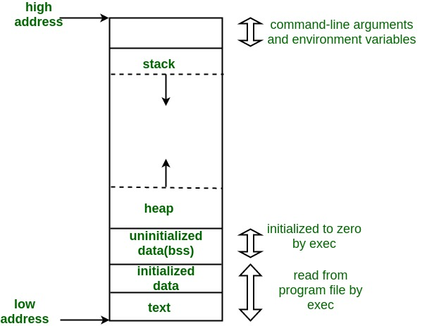

## B. Examples
The size in command line reports the sizes (in bytes) of the text, data, and bss segments.  s
**1. Check the following simple C program**

    #include <stdio.h>

    int main(void)
    {
        return 0;
    }
    //terminal:
    //text       data        bss        dec        hex    filename
    //960        248          8       1216        4c0    memory-layout

**2. Let add one global variable in the program, now check the size of bss**

    #include <stdio.h>

    int global; /* Uninitialized variable stored in bss*/

    int main(void)
    {
        return 0;
    }
    //terminal:
    //text       data        bss        dec        hex    filename
    //960        248         12       1220        4c4    memory-layout

**3. Let add one static variable which is also stored in bss.**

    #include <stdio.h>
    
    int global; /* Uninitialized variable stored in bss*/
    
    int main(void)
    {
        static int i; /* Uninitialized static variable stored in bss */
        return 0;
    }
    //terminal
    //text       data        bss        dec        hex    filename
    //960        248         16       1224        4c8    memory-layout

**4. Let initialize the static variable which will then be stored in the Data Segment.**

    #include <stdio.h>
    
    int global; /* Uninitialized variable stored in bss*/
    
    int main(void)
    {
        static int i = 100; /* Initialized static variable stored in DS*/
        return 0;
    }
    //terminal
    //text       data        bss        dec        hex    filename
    //960         252         12       1224        4c8    memory-layout

**5. Let initialize the global variable which will then be stored in the Data Segment.**

    #include <stdio.h>
    
    int global = 10; /* initialized global variable stored in DS*/
    
    int main(void)
    {
        static int i = 100; /* Initialized static variable stored in DS*/
        return 0;
    }
    //terminal
    //text       data        bss        dec        hex    filename
    //960         256          8       1224        4c8    memory-layout

# **LESSON 5: EXTERN - STATIC - VOLATILE - REGISTER**
## A. Extern 
The extern variable extends the scope of the variable in multiple source code files.

func.h

    #ifndef FUNC_H  
    #define FUNC_H  
    #include <stdio.h>  
    void func_count();  
    #endif /* FUNC_H */  

func.c  

    #include "func.h"  
    extern int count;  
    void func_count()
    {  
        while(count < 10)
        {  
            printf("%s: count = %d \n", __FUNCTION__, count) ;  
            count++;  
        }  
    }  

main.c  

    #include <stdio.h>  
    #include "func.h"  
    int count = 5; /* global variable */  
    int main()  
    {  
        while(count--)  
    {  
        printf("%s: count = %d \n", __FUNCTION__, count);  
    }  
    func_count();  
    return 0;  
    }  

In the example, the variable count is declared in the main.c file and is extern in the func.c file.

    $ gcc func.c main.c   
    $ ./a.out   
    main: count = 4   
    main: count = 3   
    main: count = 2   
    main: count = 1   
    main: count = 0   
    func_count: count = -1   
    func_count: count = 0   
    func_count: count = 1   
    func_count: count = 2   
    func_count: count = 3   
    func_count: count = 4   
    func_count: count = 5   
    func_count: count = 6   
    func_count: count = 7   
    func_count: count = 8   
    func_count: count = 9   

The result shows that count in func.c is also count in main.c being expanded

Extern for functions: similar to the example above but without the func.c header file to include

func.c

    #include <stdio.h>  
    static int count = 5;  
    void func_count()
    {  
        while(count < 10)
        {  
            printf("%s: count = %d \n", __FUNCTION__, count) ;  
            count++;  
        }  
    }  

main.c

    #include <stdio.h>  
    extern void func_count();  
    int main()  
    {  
        int count = 5;  
            while(count--)  
            {  
                printf("%s: count = %d \n", __FUNCTION__, count);  
            }  
        func_count();  
    return 0;  
    }  

Compile & Execute, this is the output:  

    $ gcc func.c main.c   
    $ ./a.out   
    main: count = 4   
    main: count = 3   
    main: count = 2   
    main: count = 1   
    main: count = 0   
    func_count: count = 5   
    func_count: count = 6   
    func_count: count = 7   
    func_count: count = 8   
    func_count: count = 9   

## B. Static  
Static variables have two uses, to limit the scope of the variable within a source code file and to maintain the value of a local variable when exiting a function.

***Method 1: Limit the scope of variables within a file source code
For example, a project has multiple source files***  
For example, a project has multiple source files.

func.h  

    #ifndef FUNC_H  
    #define FUNC_H  
    #include <stdio.h>  
    void func_count();  
    #endif /* FUNC_H */  

func.c  

    #include "func.h"  
    static int count = 5; /* global variable */  
    void func_count()
    {  
        while(count < 10)
        {  
            printf("%s: count = %d \n", __FUNCTION__, count) ;  
            count++;  
        }  
    }  

main.c  

    #include <stdio.h>  
    #include "func.h"  
    static int count = 5; /* global variable */  
    int main()  
    {  
        while(count--)  
        {  
            printf("%s: count = %d \n", __FUNCTION__, count);  
        }  
    func_count();  
    return 0;  
    }  

In the example above, there are two global variables count declared in two source files, func.c and main.c  

Being declared as static, even though they have the same name, they are totally different variables.

    $ gcc func.c main.c   
    $ ./a.out   
    main: count = 4   
    main: count = 3   
    main: count = 2   
    main: count = 1   
    main: count = 0   
    func_count: count = 5   
    func_count: count = 6   
    func_count: count = 7   
    func_count: count = 8   
    func_count: count = 9   

If not declared static, there will be a multiple-definition error during compilation.

    $ gcc func.c main.c   
    /tmp/ccm9bYEF.o:(.data+0x0): multiple definition of `count'  
    /tmp/cc9uDZlE.o:(.data+0x0): first defined here  
    collect2: error: ld returned 1 exit status  

***Method 2: Maintain the value of a local variable after the function has been executed. Note that when declaring a static variable, it must have an initial value.***

main2.c  

    #include <stdio.h>  
    /* function declaration */  
    void func(void);  
    main()  
    {  
        int count = 5;  
        while(count--)  
        {  
            func();  
        }  
        return 0;  
    }  
    /* function definition */  
    void func( void )  
    {  
        static int i = 5; /* local static variable, must set initial value, is 5 */  
        int k = 5; /* local variable */  
        printf("i = %d, k = %d \n", i, k);  
        i++;  
        k++;  
    }  

In the void func(void) function, the local variable i is declared static, while 'k' is a regular local variable.

    $ gcc main2.c   
    $ ./a.out   
    i = 5, k = 5   
    i = 6, k = 5   
    i = 7, k = 5   
    i = 8, k = 5   
    i = 9, k = 5   

The variable 'i' still retains its value after each function call.

## C. Volatile  
When a variable is declared with the volatile keyword, the compiler will not optimize it, volatile variables are typically used in interrupt functions and multi-threaded environments.

Example about optimize:  

    int count;  
    count = 1;   
    count = 2;   
    count = 3;  

then the compiler will optimize it into the following form after compilation: 

    count = 3;  

If count is declared as volatile  

    volatile int count;  
    count = 1;   
    count = 2;   
    count = 3; 

 when compiling, the compiler still maintains the operations when executing the program
 
    count = 1;   
    count = 2;   
    count = 3; 

In summary, when you want a variable to execute all operations on it without being optimized, use it with the volatile type

## D. Register
Register type is used to declare local variables located on the CPU registers instead of RAM, aiming to speed up operations with that variable, thus it is used with variables accessed many times such as counter for example.  

    register int miles;  

**Example:**

    #include <stdio.h>
    #include <time.h>
        
    int main() 
    {
        // Save the start time
        clock_t start_time = clock();
        int i;
        
        // code segment
        for (i = 0; i < 2000000; ++i)
        {
            // ToDo specific tasks
        }
        
        // Save the end time
        clock_t end_time = clock();
        
        // Calculate the running time by milisecond
        double time_taken = ((double)(end_time - start_time)) / CLOCKS_PER_SEC;
        
        printf("The running time of the program: %f giay\n", time_taken);
        
        return 0;
    }

# **LESSON 6: GOTO - SETJMP.H**
## A. goto 
***Concept***  
In C programming **goto statement** is a jump statement which is sometimes also referred to as an unconditional jump statement. The goto statement can be used to jump from anywhere to anywhere within a function. 

***Syntax***

    Syntax1      |   Syntax2
    ----------------------------
    goto label;  |    label:  
    .            |    .
    .            |    .
    .            |    .
    label:       |    goto label;

- In the above syntax, the first line tells the compiler to go to or jump to the statement marked as a label. 
- Here, the label is a user-defined identifier that indicates the target statement. The statement immediately followed after ‘label:’ is the destination statement. 
- The ‘label:’ can also appear before the ‘goto label;’ statement in the above syntax. 

***Flowchart***

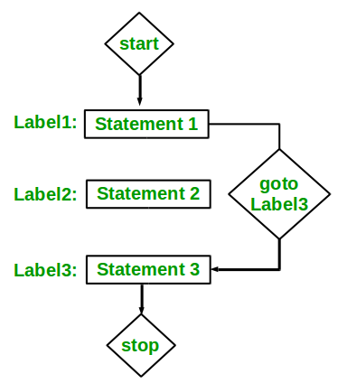

***Example***

**Type 1:** In this case, we will see a situation similar to as shown in **Syntax 1** above. Suppose we need to write a program where we need to check if a number is even or not and print accordingly using the goto statement.

    #include <stdio.h> 

    void checkEvenOrNot(int num) 
    { 
        if (num % 2 == 0) 
            // jump to even 
            goto even; 
        else
            // jump to odd 
            goto odd; 

    even: 
        printf("%d is even", num); 
        return; 
    odd: 
        printf("%d is odd", num);
        return;
    } 

    int main() 
    { 
        int num = 36; 
        checkEvenOrNot(num); 
        return 0; 
    }

**Output**

    36 is even

**Type 2:** In this case, we will see a situation similar to as shown in **Syntax 2** above. Suppose we need to write a program that prints numbers from 1 to 10 using the goto statement.

    #include <stdio.h> 

    void printNumbers() 
    { 
        int n = 1; 
    label: 
        printf("%d ", n); 
        n++; 
        if (n <= 10) 
            goto label; 
    } 

    int main() 
    { 
        printNumbers(); 
        return 0; 
    }

**Output**

    1 2 3 4 5 6 7 8 9 10

## B. setjmp.h
***Concept***  
The **setjmp.h** header defines the macro **setjmp()**, one function **longjmp()**, and one variable type **jmp_buf**, for bypassing the normal function call and return discipline.

***Library Variables***  
Variable type defined in the header setjmp.h

    Variable : jmp_buf

    Description : This is an array type used for holding information for macro setjmp() and function longjmp()

***Library Macros***  
There is only one macro defined in this library

    Macro : int setjmp(jmp_buf environment)

    Description : This macro saves the current environment into the variable environment for later use by the function longjmp(). If this macro returns directly from the macro invocation, it returns zero but if it returns from a longjmp() function call, then a non-zero value is returned.

***Library Functions***  
The only one function defined in the header setjmp.h

    Function : 	void longjmp(jmp_buf environment, int value)

    Description : This function restores the environment saved by the most recent call to setjmp() macro in the same invocation of the program with the corresponding jmp_buf argument.

***Example***

    #include <setjmp.h> 
    #include <stdio.h> 
    jmp_buf buf; 
    void func() 
    { 
        printf("Welcome to HALA Academy\n"); 

        // Jump to the point setup by setjmp 
        longjmp(buf, 1); 

        printf("C/C++ Advanced\n"); 
    } 

    int main() 
    { 
        // Setup jump position using buf and return 0 
        if (setjmp(buf)) 
            printf("Embedded Automotive\n"); 
        else 
        { 
            printf("Embedded Interview\n"); 
            func(); 
        } 
        return 0; 
    }

**Output**

    Embedded Interview
    Welcome to HALA Academy
    Embedded Automotive

# **LESSON 7: BITMASKING**
## A. Introduction
***What is a Bit?***  
- A bit is the smallest unit of data which can either store a 0 or 1 inside it.
- All the data in the computer is stored using these bits.
- These 2 possible values can also be represented as boolean values that are True or False.
- Using this we can apply boolean logic to manipulate data stored on the computer.

***What is Bitmasking?***  
- Bitmasking is a technique that involves bit manipulation.
- It is basically like putting a mask over certain bits and hiding the other un-useful bits, so as to make the program much more efficient and optimize the memory.
- A bitmask is a sequence of bits that can also be known as a bitset or bit field and is used to perform bitwise operations on the given data.

***6 bitwise operators in C***
- & (Bitwise AND Operator)
- | (Bitwise OR Operator)
- ^ (Bitwise XOR Operator)
- ~ (Bitwise NOT Operator)
- *>>* (Right Shift Operator)
- << (Left Shift Operator)

## B. Bitmask Techniques
**1. Reverse a bit by NOT bitwise**  
Used to perform a bitwise NOT operation on each bit of a number. The result is the reverse bit of that number.

***Syntax***

    number = ~ number

***Example***

    #include <stdio.h> 

    int main() 
    { 

        int x = 1; 

        printf("Ans: %d", ~x); 

        return 0; 
    }

***Output***

    Ans: -2

**2. Setting a bit**  
Basically, we take the integer 1 and using the left shift operator, shift the binary representation of 1 to n places where (n+1) is the place of bit which we want to set. Then using the bitwise OR operator we turn the given number’s (n+1)^th bit to 1.  

***Syntax*** 

    number | (1 << bit_position_to_set)

***Example***

    #include <stdio.h> 

    int main() 
    { 

        int x = 13; 

        printf("Ans: %d", 13 | (1 << 5)); 

        return 0; 
    }

***Output***

    Ans: 45

**3. Clearing a Bit**  
Basically, we again take 1 and shift it the the specified position. Then, we perform the NOT operation on this to convert that into a 0 and other bits of the value (1 << n) to 1. Then we do the AND operation to clear the specified bit and obtain the result.

***Syntax***  

    number & ~(1 << bit_position_to_clear)

***Example***

    #include<stdio.h> 
    
    int main() 
    { 
        int x = 13; 
        
        printf("Ans: %d", 13 & ~(1 << 2) ); 
        
        return 0; 
    }

***Output***

    Ans: 9

**4. Flipping a Bit**  
In this operation, we flip a specific bit that is if the bit is 0 then turn it to 1 else turn it to 0. This operation requires the use of bitwise XOR (^) operator along with the left shift (<<) operator.

***Syntax***  

    number ^ (1 << bit_position_to_flip)

***Example***

#include<stdio.h> 
  
    int main() 
    { 
        int x = 13; 
        
        printf("Ans: %d", 13 ^ (1 << 3) ); 
        
        return 0; 
    }

***Output***  

    Ans: 5

# **LESSON 8: STRUCT - UNION**
## A. Struct
***What is struct?***  
Struct or structure is a data type that you define by combining many existing data types for the purpose of describing multiple fields of information of the object you need to store.

***Syntax***  

    struct ten_struct
    {
        data_type1 data_field1;
        data_type2 data_field2;
        ....
        data_typen data_fieldn;
    };
In a struct, you will list the fields that you need to store for the structure you are building along with the data type of that field.

***Example***  

    #include <stdio.h>
    #include <string.h>

    struct SinhVien{
        char hoten[50];
        char email[50];
        char lop[30];
        double gpa;
    };
    //Replace struct SinhVien = SinhVien
    typedef struct SinhVien SinhVien;

    int main(){
        SinhVien s; // struct SinhVien cung duoc
        strcpy(s.hoten, "Nguyen Van A");
        strcpy(s.email, "abcd@gmail.com");
        strcpy(s.lop, "CNTT");
        s.gpa = 2.1;
        printf("Thong tin sinh vien : \n");
        printf("Ho ten : %s\n", s.hoten);
        printf("Email : %s\n", s.email);
        printf("Lop : %s\n", s.lop);
        printf("Diem gpa : %.2lf\n", s.gpa);
        return 0;
    }

***Output***

    Thong tin sinh vien : 
    Ho ten : Nguyen Van A
    Email : abcd@gmail.com
    Lop : CNTT
    Diem gpa : 2.10

- After building the structure, you can use it as a regular data type and declare variables belonging to this structure type.
- Note that in C structure declaration, you need to add the keyword 'struct' in front. If you do not want to declare the 'struct' keyword every time you use the structure, you can use typedef to redefine the type for the structure.
- To access the data fields of the structure, you use the '.' (dot operator).

## B. Union
***What is union?***
- Union is also a data type that users define themselves, similar to struct, union also has data members to describe information of the object you want to store.
- However, the difference with struct is that while its members can store values simultaneously at the same time, union, on the other hand, at each moment, you only have one attribute of union storing some value.
- All members of the union will share the same memory space.

***Syntax***

    union union_name
    {
        data_type1 member1;
        data_type2 member2;
        data_type3 member3;
        ....
        data_typeN memberN;
    };
To access the members of a union, you also use the '.' operator with a normal union variable or the '->' operator with a union pointer.

***Example 1: The attributes of a union will have the same value at the same time***

    #include <stdio.h>
    #include <string.h>

    union SinhVien
    {
        char masv[20];
        char hoten[50];
        double gpa;
    };

    typedef union SinhVien SinhVien;

    int main()
    {
        SinhVien s;
        strcpy(s.masv, "CNTT1");
        strcpy(s.hoten, "Nguyen Van A");
        printf("Ma sinh vien : %s\n", s.masv);
        printf("Ho ten : %s\n", s.hoten);
        return 0;
    }

***Output***  

    Ma sinh vien : CNTT1
    Ho ten : Nguyen Van A

***Example 2: The size of a union will be the size of its largest attribute***

    #include <stdio.h>
    #include <string.h>

    union Example1
    {
        char kitu;
        double sothuc;
        int songuyen;
    };

    typedef union Example1 Example1;

    union Example2
    {
        char x[20];
        char y[10];
        int n;
    };

    typedef union Example2 Example2;

    int main()
    {
        printf("%d\n%d\n", sizeof(Example1), sizeof(Example2));
        return 0;
    }

***Output***  

    8
    20

## C. The difference between union and struct
Union and Struct have similarities including:

- Both are user-defined data types to serve practical problems
- Have component properties
- Access properties through the '.' operator or '->' for pointer type variables

The differences between the two user-defined data types are listed below:  
**struct**
- The size of a struct is usually larger than or equal to the sum of all sizes of its component attributes.
- A struct can simultaneously store multiple values for its component attributes at the same time.
- Declared with the keyword struct.

**union**  
- The size of a union is equal to the size of its largest attribute.
- Only one component attribute of a union can store a value at a time.
- Declared with the keyword union.

# **LESSON 10: LINKED LIST**
## A. Introduction
***Compare Linked list with Array?***  
Linked list have a few advantages over arrays:

- Items can be added or removed from the middle of the list  
- There is no need to define an initial size

However, linked list also have a few disadvantages:

- There is no "random" access - it is impossible to reach the n^th item in the array without first iterating over all items up until that item. This means we have to start from the beginning of the list and count how many times we advance in the list until we get to the desired item.  
- Dynamic memory allocation and pointers are required, which complicates the code and increases the risk of memory leaks and segment faults.  
- Linked lists have a much larger overhead over arrays, since linked list items are dynamically allocated (which is less efficient in memory usage) and each item in the list also must store an additional pointer.

***What is linked list?***  
**Linked List** is a linear data structure, in which elements are not stored at a contiguous location, rather they are linked using pointers. Linked List forms a series of connected nodes, where each node stores the data and the address of the next node.

**Node Structure:** A node in a linked list typically consists of two components:  
**Data:** It holds the actual value or data associated with the node.  
**Next Pointer:** It stores the memory address (reference) of the next node in the sequence.  
**Head and Tail:** The linked list is accessed through the head node, which points to the first node in the list. The last node in the list points to NULL or nullptr, indicating the end of the list. This node is known as the tail node.  

***Let's define a linked list node:***

    typedef struct node {
        int val;
        struct node * next;
    } node_t;

Notice that we are defining the struct in a recursive manner, which is possible in C. Let's name our node type node_t.

***Now we can use the nodes. Let's create a local variable which points to the first item of the list (called head).***

    node_t * head = NULL;
    head = (node_t *) malloc(sizeof(node_t));
    if (head == NULL) {
        return 1;
    }

    head->val = 1;
    head->next = NULL;

We've just created the first variable in the list. We must set the value, and the next item to be empty, if we want to finish populating the list. Notice that we should always check if malloc returned a NULL value or not.

***To add a variable to the end of the list, we can just continue advancing to the next pointer:***

    node_t * head = NULL;
    head = (node_t *) malloc(sizeof(node_t));
    head->val = 1;
    head->next = (node_t *) malloc(sizeof(node_t));
    head->next->val = 2;
    head->next->next = NULL;

This can go on and on, but what we should actually do is advance to the last item of the list, until the next variable will be NULL.

## B. Iterating over a list
Let's build a function that prints out all the items of a list. To do this, we need to use a current pointer that will keep track of the node we are currently printing. After printing the value of the node, we set the current pointer to the next node, and print again, until we've reached the end of the list (the next node is NULL).

    void print_list(node_t * head) {
        node_t * current = head;

        while (current != NULL) {
            printf("%d\n", current->val);
            current = current->next;
        }
    }

## C. Adding an item to the end of the list
To iterate over all the members of the linked list, we use a pointer called current. We set it to start from the head and then in each step, we advance the pointer to the next item in the list, until we reach the last item.

    void push(node_t * head, int val) {
        node_t * current = head;
        while (current->next != NULL) {
            current = current->next;
        }

        /* now we can add a new variable */
        current->next = (node_t *) malloc(sizeof(node_t));
        current->next->val = val;
        current->next->next = NULL;
    }

## D. Adding an item to the beginning of the list (pushing to the list)
To add to the beginning of the list, we will need to do the following:
- Create a new item and set its value
- Link the new item to point to the head of the list
- Set the head of the list to be our new item  

This will effectively create a new head to the list with a new value, and keep the rest of the list linked to it.

Since we use a function to do this operation, we want to be able to modify the head variable. To do this, we must pass a pointer to the pointer variable (a double pointer) so we will be able to modify the pointer itself.

    void push(node_t ** head, int val) {
        node_t * new_node;
        new_node = (node_t *) malloc(sizeof(node_t));

        new_node->val = val;
        new_node->next = *head;
        *head = new_node;
    }

## E. Removing the first item (popping from the list)
To pop a variable, we will need to reverse this action:
- Take the next item that the head points to and save it
- Free the head item
- Set the head to be the next item that we've stored on the side  

Here is the code:

    int pop(node_t ** head) {
        int retval = -1;
        node_t * next_node = NULL;

        if (*head == NULL) {
            return -1;
        }

        next_node = (*head)->next;
        retval = (*head)->val;
        free(*head);
        *head = next_node;

        return retval;
    }

## F. Removing the last item of the list
Removing the last item from a list is very similar to adding it to the end of the list, but with one big exception - since we have to change one item before the last item, we actually have to look two items ahead and see if the next item is the last one in the list:

    int remove_last(node_t * head) {
        int retval = 0;
        /* if there is only one item in the list, remove it */
        if (head->next == NULL) {
            retval = head->val;
            free(head);
            return retval;
        }

        /* get to the second to last node in the list */
        node_t * current = head;
        while (current->next->next != NULL) {
            current = current->next;
        }

        /* now current points to the second to last item of the list, so let's remove current->next */
        retval = current->next->val;
        free(current->next);
        current->next = NULL;
        return retval;

    }

## G. Removing a specific item
To remove a specific item from the list, either by its index from the beginning of the list or by its value, we will need to go over all the items, continuously looking ahead to find out if we've reached the node before the item we wish to remove. This is because we need to change the location to where the previous node points to as well.

Here is the algorithm:
- Iterate to the node before the node we wish to delete
- Save the node we wish to delete in a temporary pointer
- Set the previous node's next pointer to point to the node after the node we wish to delete
- Delete the node using the temporary pointer  

Code sample:

    int remove_by_index(node_t ** head, int n) {
        int i = 0;
        int retval = -1;
        node_t * current = *head;
        node_t * temp_node = NULL;

        if (n == 0) {
            return pop(head);
        }

        for (i = 0; i < n-1; i++) {
            if (current->next == NULL) {
                return -1;
            }
            current = current->next;
        }

        if (current->next == NULL) {
            return -1;
        }

        temp_node = current->next;
        retval = temp_node->val;
        current->next = temp_node->next;
        free(temp_node);

        return retval;

    }

# **LESSON 11: STACK - QUEUE**
## A. Stack
***What is Stack?***  
Stack is a linear data structure based on LIFO(Last In First Out) principle in which the insertion of a new element and removal of an existing element takes place at the same end represented as the top of the stack.  

***How to implement Stack?***  
To implement the stack, it is required to maintain the pointer to the top of the stack , which is the last element to be inserted because we can access the elements only on the top of the stack.

***LIFO(Last In First Out) Principle in Stack:***  
This strategy states that the element that is inserted last will come out first. You can take a pile of plates kept on top of each other as a real-life example. The plate which we put last is on the top and since we remove the plate that is at the top, we can say that the plate that was put last comes out first.

***Representation of Stack Data Structure:***  
Stack follows LIFO (Last In First Out) Principle so the element which is pushed last is popped first.
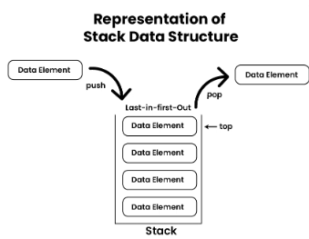

***Basic Operations on Stack:***  
In order to make manipulations in a stack, there are certain operations provided to us.
- push() to insert an element into the stack
- pop() to remove an element from the stack
- top() Returns the top element of the stack.
- isEmpty() returns true if stack is empty else false.
- isFull() returns true if the stack is full else false.

***Push Operation in Stack:***  
->Adds an item to the stack. If the stack is full, then it is said to be an **Overflow** condition.  
->**Algorithm** for Push Operation:
- Before pushing the element to the stack, we check if the stack is full .
- If the stack is full (top == capacity-1) , then Stack Overflows and we cannot insert the element to the stack.
- Otherwise, we increment the value of top by 1 (top = top + 1) and the new value is inserted at top position.
- The elements can be pushed into the stack till we reach the capacity of the stack.

***Pop Operation in Stack:***  
->Removes an item from the stack. The items are popped in the reversed order in which they are pushed. If the stack is empty, then it is said to be an **Underflow** condition.  
->**Algorithm** for Pop Operation:
- Before popping the element from the stack, we check if the stack is empty .
- If the stack is empty (top == -1), then Stack Underflows and we cannot remove any element from the stack.
- Otherwise, we store the value at top, decrement the value of top by 1 (top = top – 1) and return the stored top value.

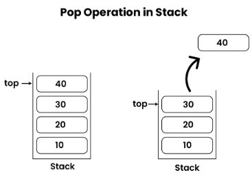

***Top or Peak Operation in Stack:***  
->Returns the top element of the stack.  
->**Algorithm** for Top Operation:
- Before returning the top element from the stack, we check if the stack is empty.
- If the stack is empty (top == -1), we simply print “Stack is empty”.
- Otherwise, we return the element stored at index = top.

***isEmpty Operation in Stack:***  
->Returns true if the stack is empty, else false.  
->**Algorithm** for isEmpty Operation :
- Check for the value of top in stack.
- If (top == -1) , then the stack is empty so return true.
- Otherwise, the stack is not empty so return false.

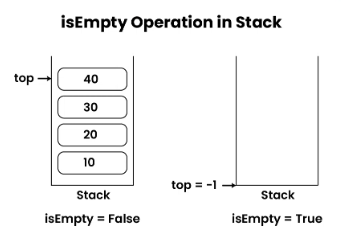

***isFull Operation in Stack:***  
->Returns true if the stack is full, else false.  
->**Algorithm** for isFull Operation:
- Check for the value of top in stack.
- If (top == capacity-1), then the stack is full so return true.
- Otherwise, the stack is not full so return false.

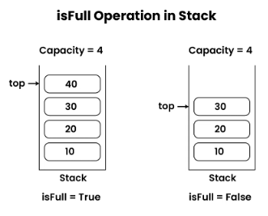

***Stack Implementation:***  
In this implementation, the push operation is implemented by incrementing the index of the top element and storing the new element at that index. The pop operation is implemented by returning the value stored at the top index and then decrementing the index of the top element.

    #include <limits.h>
    #include <stdio.h>
    #include <stdlib.h>

    struct Stack 
    {
        int top;
        unsigned capacity;
        int* array;
    };

    // function to create a stack of given capacity. It initializes size of stack as 0
    struct Stack* createStack(unsigned capacity)
    {
        struct Stack* stack = (struct Stack*)malloc(sizeof(struct Stack));
        stack->capacity = capacity;
        stack->top = -1;
        stack->array = (int*)malloc(stack->capacity * sizeof(int));
        return stack;
    }

    // Stack is full when top is equal to the last index
    int isFull(struct Stack* stack)
    {
        return stack->top == stack->capacity - 1;
    }

    // Stack is empty when top is equal to -1
    int isEmpty(struct Stack* stack)
    {
        return stack->top == -1;
    }

    // Function to add an item to stack.  It increases top by 1
    void push(struct Stack* stack, int item)
    {
        if (isFull(stack))
            return;
        stack->array[++stack->top] = item;
        printf("%d pushed to stack\n", item);
    }

    // Function to remove an item from stack.  It decreases top by 1
    int pop(struct Stack* stack)
    {
        if (isEmpty(stack))
            return INT_MIN;
        return stack->array[stack->top--];
        printf("%d popped to stack\n", item);
    }

    // Function to return the top from stack without removing it
    int top(struct Stack* stack)
    {
        if (isEmpty(stack))
            return INT_MIN;
        return stack->array[stack->top];
        printf("Top element is : %d\n", item);
    }

    int main()
    {
        struct Stack* stack = createStack(100);

        push(stack, 10);
        push(stack, 20);
        push(stack, 30);
        pop(stack, 30);
        top(stack);

        return 0;
    }

***Output:***

    10 pushed into stack
    20 pushed into stack
    30 pushed into stack
    30 popped from stack
    Top element is : 20
    Elements present in stack : 20 10 

## B. Queue
***What is Queue?***  
- Queue is a linear data structure that is open at both ends and the operations are performed in First In First Out (FIFO) order.
- We define a queue to be a list in which all additions to the list are made at one end (back of the queue), and all deletions from the list are made at the other end(front of the queue). 
 - The element which is first pushed into the order, the delete operation is first performed on that. 

***FIFO Principle of Queue:***  
- A Queue is like a line waiting to purchase tickets, where the first person in line is the first person served. 
- Position of the entry in a queue ready to be served, that is, the first entry that will be removed from the queue, is called the front of the queue (or head of the queue). 
- Similarly, the position of the last entry in the queue, that is, the one most recently added, is called the rear (or the tail) of the queue.

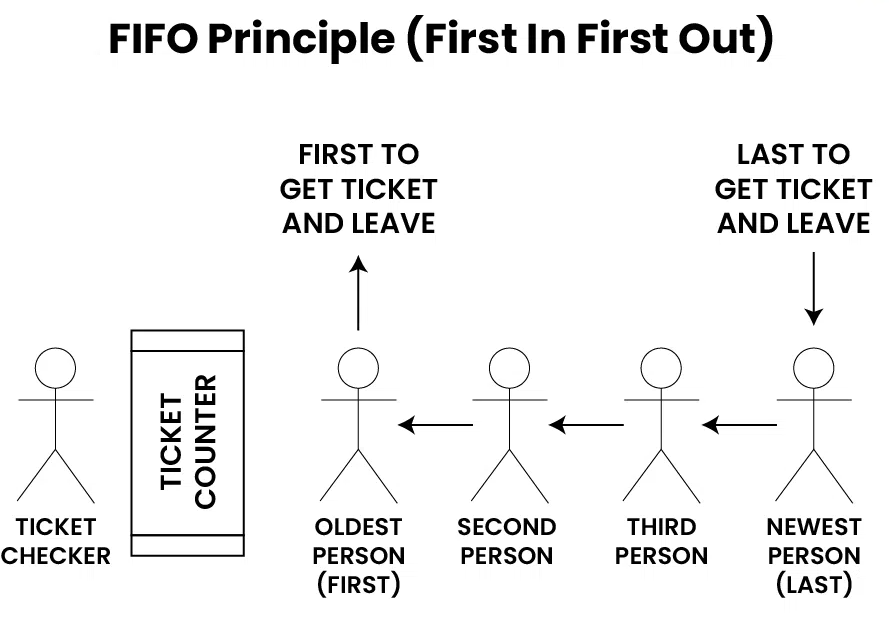

***Representation of Queue Data Structure:***  

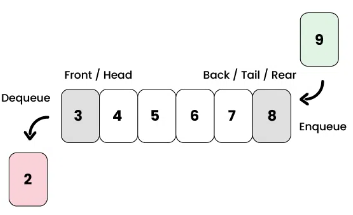

***Basic Operations in Queue:***  
Some of the basic operations for Queue in Data Structure are:
- Enqueue: Adds (or stores) an element to the end of the queue..
- Dequeue: Removal of elements from the queue.
- Peak or front: Acquires the data element available at the front node of the queue without deleting it.
- rear or tail: This operation returns the element at the rear end without removing it.
- isFull: Validates if the queue is full.
- isEmpty: Checks if the queue is empty.

***Enqueue Operation in Queue:***   
->Enqueue() operation in Queue **adds (or stores) an element to the end of the queue.**  
->The following steps should be taken to enqueue (insert) data into a queue:

- Check if the queue is full.
- If the queue is full, return overflow error and exit.
- If the queue is not full, increment the rear pointer to point to the next empty space.
- Add the data element to the queue location, where the rear is pointing.
- return success.

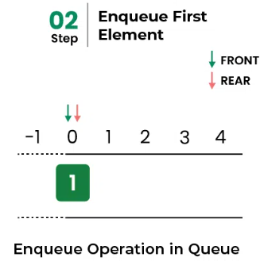            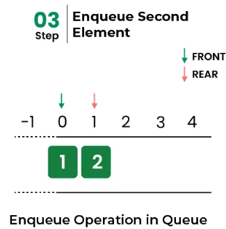

***Implementation of Enqueue:***

    // Function to add an item to the queue.
    // It changes rear and size
    void enqueue(struct Queue* queue, int item)
    {
        if (isFull(queue))
            return;
        queue->rear = (queue->rear + 1) % queue->capacity;
        queue->array[queue->rear] = item;
        queue->size = queue->size + 1;
        printf("%d enqueued to queue\n", item);
    }

***Dequeue Operation in Queue:***   
->Removes (or access) **the first element from the queue.**  
->The following steps are taken to perform the dequeue operation:

- Check if the queue is empty.
- If the queue is empty, return the underflow error and exit.
- If the queue is not empty, access the data where the front is pointing.
- Increment the front pointer to point to the next available data element.
- The Return success.

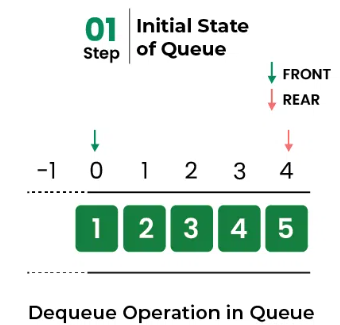  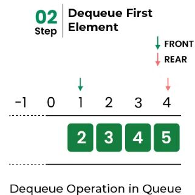

***Implementation of dequeue:***

    // Function to remove an item from queue.
    // It changes front and size
    int dequeue(struct Queue* queue)
    {
        if (isEmpty(queue)) {
            printf("\nQueue is empty\n");
            return;
        }
        int item = queue->array[queue->front];
        queue->front = (queue->front + 1) % queue->capacity;
        queue->size = queue->size - 1;
        return item;
    }

***Front Operation in Queue:***

    // Function to get front of queue
    int front(struct Queue* queue)
    {
        if (isempty(queue))
            return INT_MIN;
        return queue->arr[queue->front];
    }

***Rear Operation in Queue:***

    int rear(struct Queue* front)
    {
        if (front == NULL) {
            printf("Queue is empty.\n");
            return -1;
        }

        while (front->next != NULL) {
            front = front->next;
        }

        return front->data;
    }

***isEmpty Operation in Queue:***

    // Queue is empty when size is 0
    bool isEmpty(struct Queue* queue)
    {
        return (queue->size == 0);
    }

***isFull Operation in Queue:***

    // Queue is full when size becomes equal to the capacity
    bool isFull(struct Queue* queue)
    {
        return (queue->size == queue->capacity);
    }

***Queue Implementation:***

    struct Queue {
        int front, rear, size;
        unsigned capacity;
        int* array;
    };

    // function to create a queue of given capacity.
    // It initializes size of queue as 0
    struct Queue* createQueue(unsigned capacity)
    {
        struct Queue* queue = (struct Queue*)malloc(sizeof(struct Queue));
        queue->capacity = capacity;
        queue->front = queue->size = 0;

        // This is important, see the enqueue
        queue->rear = capacity - 1;
        queue->array = (int*)malloc(queue->capacity * sizeof(int));
        return queue;
    }

